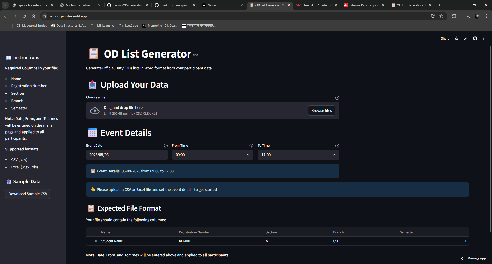
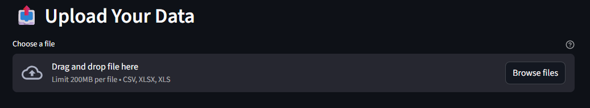
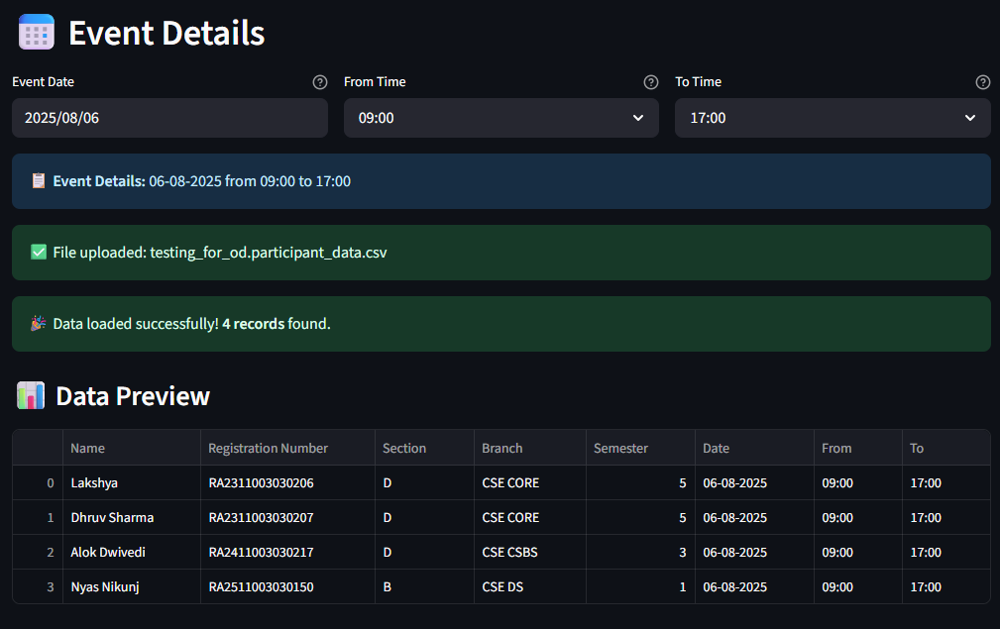
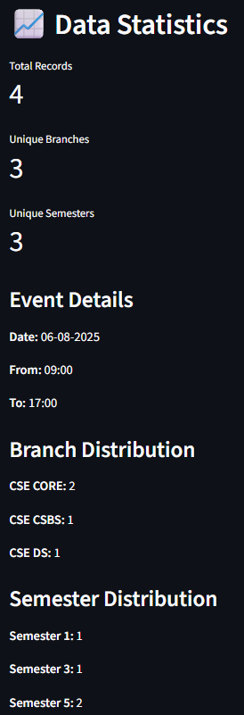

# 📋 OD List Generator ✨

> 🚀 **Transform your participant data into professional OD documents in seconds!** 🚀

**The ultimate solution for generating Official Duty (OD) lists with style and efficiency!** Say goodbye to manual document creation and hello to automated, beautifully formatted Word documents that'll make your admin life a breeze! 🌟

## 🎯 What Does This Magic Do?

🔥 **ONE-CLICK TRANSFORMATION**: Upload your CSV/Excel → Get professional Word documents
📊 **SMART SORTING**: Automatically organizes by semester and branch
⏰ **UNIFIED TIMING**: Set one date/time for all participants
🎨 **PROFESSIONAL FORMATTING**: Clean tables with perfect borders and styling
🌐 **WEB-BASED**: No installation needed - runs in your browser!

## 🌟 Features That'll Blow Your Mind

### 🎪 **Interactive Web Interface**

- 📤 **Drag \& Drop** file uploads (CSV/Excel)
- 📅 **Date Picker** for event dates
- ⏲️ **Time Selectors** for From/To times
- 📊 **Live Data Preview** with statistics
- 📥 **Instant Download** of generated documents

### 🧠 **Smart Data Processing**

- 🔄 **Auto-sorting** by semester (1→2→3→4...) then by branch (A→Z)
- 📋 **Data validation** with helpful error messages
- 📈 **Real-time statistics** showing records, branches, semesters
- 🎯 **Duplicate handling** and data cleaning

### 🎨 **Professional Document Output**

- 📄 **Perfect Word formatting** with proper tables and borders
- 🏷️ **Branch-wise separation** with clear headers
- 📊 **Organized layout** with Event Coordinator, HSW, HOD signatures
- 🎭 **Clean typography** with bold headers and proper spacing

## 🚀 Quick Start Guide

### 📋 **Step 1: Prepare Your Data**

Create a CSV/Excel file with these columns:

```csv
Name,Registration Number,Section,Branch,Semester
John Doe,REG001,A,CSE,1
Jane Smith,REG002,B,ECE,2
Mike Johnson,REG003,A,CSE,1
```

### 🌐 **Step 2: Launch the App**

```bash
# Install dependencies
pip install streamlit pandas python-docx openpyxl

# Run the magic
streamlit run app.py
```

### ✨ **Step 3: Generate Documents**

1. 📤 **Upload** your participant file
2. 📅 **Select** event date
3. ⏰ **Set** from/to times
4. 🚀 **Click** "Generate OD Document"
5. 📥 **Download** your professional document!

## 📁 Project Structure

```
📦 od-list-generator/
├── 🐍 app.py                 # Main Streamlit application
├── 📋 requirements.txt       # Dependencies
└── 📖 README.md             # This awesome file
```

## 🎪 Sample Data Format

### 📥 **Input (CSV/Excel)**

| Name         | Registration Number | Section | Branch   | Semester |
| :----------- | :------------------ | :------ | :------- | :------- |
| Alice Wonder | RA2311001           | A       | CSE CORE | 5        |
| Bob Builder  | RA2411002           | B       | CSE CSBS | 3        |
| Carol Singer | RA2511003           | C       | CSE DS   | 1        |

### 📤 **Output (Word Document)**

```
📄 Course: B.Tech CSE CORE        Year/Semester: 3/5
┌─────┬───────────┬─────────────┬─────────┬────────────┬───────────────┐
│S.No │   Name    │ Reg. Number │ Section │    Date    │     Hours     │
│     │           │             │         │            │ From │   To   │
├─────┼───────────┼─────────────┼─────────┼────────────┼──────┼────────┤
│  1  │Alice W... │ RA2311001   │    A    │ 15-01-2024 │09:00 │ 17:00  │
└─────┴───────────┴─────────────┴─────────┴────────────┴──────┴────────┘

Event Coordinator          Head Student Welfare          HOD
```

## 💻 Requirements

### 🔧 **System Requirements**

- 🐍 **Python 3.7+**
- 🌐 **Modern Web Browser**
- 💾 **50MB+ Free Space**

### 📦 **Dependencies**

```txt
streamlit>=1.28.0    # 🎨 Web interface magic
pandas>=1.5.3        # 📊 Data manipulation wizardry
python-docx>=0.8.11  # 📄 Word document creation
openpyxl>=3.1.2      # 📊 Excel file reading
```

## 🎯 Real-World Use Case: SRM IST Edition

> 💡 **Why was this built? Because at SRM IST, the HODs have a _legendary_ eye for OD formats!**

If you’ve ever organized an event here, you know the _struggle_:

- 🧐 **HODs want it _just so_**: Every OD must be in the _perfect_ format—no extra lines, no missing columns, signatures in the right spot, and don’t even think about the wrong font!
- 😅 **Organizers juggling formats**: Each event, a new OD template. “Can you move this column?” “Where’s the branch header?” “Why is the table border so thick?” Sound familiar?
- 🤯 **Participants in limbo**: Waiting for that _one_ correction so their OD gets signed and they can finally attend the event.

**This tool is your secret weapon!**  
No more late-night formatting marathons or frantic WhatsApp messages about “the latest OD sample.”  
Just upload, click, and get an OD that’ll make even the pickiest HOD smile. 😎

---

### 🏫 **Perfect for SRM IST**

- 📚 Student event ODs (with all the right columns)
- 🏆 Competition attendance (sorted, signed, and sealed)
- 📝 Workshop lists (no more Excel headaches)
- 🎉 Any event where “format” is half the battle

> _Because at SRM, the real event is getting your OD approved!_

## 🚀 Deployment Options

### ☁️ **Streamlit Cloud** (Recommended)

```bash
# 1. Push to GitHub
git add .
git commit -m "🚀 OD Generator Ready!"
git push origin main

# 2. Deploy at share.streamlit.io
# 3. Connect GitHub repo
# 4. Launch! 🎉
```

### 🚂 **Railway**

```yaml
# railway.json
{
  "build": { "builder": "NIXPACKS" },
  "deploy": { "startCommand": "streamlit run app.py --server.port $PORT" },
}
```

### 🎨 **Render**

```yaml
# render.yaml
services:
  - type: web
    name: od-generator
    env: python
    buildCommand: pip install -r requirements.txt
    startCommand: streamlit run app.py --server.port $PORT --server.address 0.0.0.0
```

## 🎪 Demo Screenshots

### 🏠 **Home Page**



### 📤 **File Upload**



### 📊 **Data Preview**

<div style="display: flex; gap: 16px;">
  
  
</div>

### 📄 **Document Output**

🎉 **Ready to WOW your HOD?**  
Step right up and let the OD List Generator work its magic!  
Upload your data, click a button, and—abracadabra!—your Word document appears in the **EXACT format** your higher-ups demand.  
No more font drama, no more border battles, no more “Can you move this column?” headaches.  
Just pure, pixel-perfect OD lists, signed, sealed, and ready for approval!

✨ **Try it now and see your admin life transform!**  
Your next OD document is just one click away—come join the formatting revolution!

## 🛠️ Advanced Configuration

### 🎨 **Customizing Output Format**

```python []
# Modify document styling
def set_custom_style():
    # Change colors, fonts, spacing
    return custom_style

# Add company branding
def add_header_logo():
    # Insert logo and company details
    return branded_header
```

### 📊 **Data Validation Rules**

```python []
# Custom validation
REQUIRED_COLUMNS = [
    'Name', 'Registration Number',
    'Section', 'Branch', 'Semester'
]

# Add custom validators
def validate_semester(semester):
    return 1 <= int(semester) <= 8
```

## 🐛 Troubleshooting

### ❌ **Common Issues**

| 🚨 Problem                   | 💡 Solution                        |
| :--------------------------- | :--------------------------------- |
| 📁 File upload fails         | Check file format (CSV/Excel only) |
| 🕐 Time validation error     | Ensure From < To time              |
| 🔢 Missing columns           | Follow required format exactly     |
| 📄 Document generation fails | Check data types and empty values  |

### 🔧 **Debug Mode**

```bash []
# Run with debug info
streamlit run app.py --logger.level debug
```

## 🤝 Contributing

### 🌟 **How to Contribute**

1. 🍴 **Fork** the repository
2. 🌿 **Create** a feature branch (`git checkout -b feature/amazing-feature`)
3. 💾 **Commit** your changes (`git commit -m '✨ Add amazing feature'`)
4. 🚀 **Push** to branch (`git push origin feature/amazing-feature`)
5. 🎯 **Open** a Pull Request

### 💡 **Ideas Welcome**

- 🎨 New document templates
- 📊 Additional data formats
- 🌐 Multi-language support
- 📱 Mobile optimization

## 📜 License

```
🎉 MIT License - Feel free to use, modify, and distribute!

Copyright (c) 2024 OD List Generator

Permission is hereby granted, free of charge, to any person obtaining a copy
of this software... (you know the rest) 😉
```

## 🎊 Acknowledgments

- 🙏 **Streamlit Team** - For the amazing framework
- 📄 **python-docx** - For Word document magic
- 🐼 **Pandas Team** - For data manipulation superpowers
- 🌟 **Open Source Community** - For inspiration and support

### 🌟 **Show Some Love**

⭐ Star this repo if you found it helpful!
🔄 Share with your colleagues!
💖 Contribute to make it even better!

<div align="center">

## 🎯 **Ready to Transform Your OD Process?**

### [🚀 **TRY IT NOW!**](http://srmodgen.streamlit.app)

**Made with ❤️ for educators, administrators, and event managers worldwide!**

</div>
*🎪 Remember: Life's too short for manual document creation! Let the OD Generator do the heavy lifting while you focus on what matters most! 🌟*
